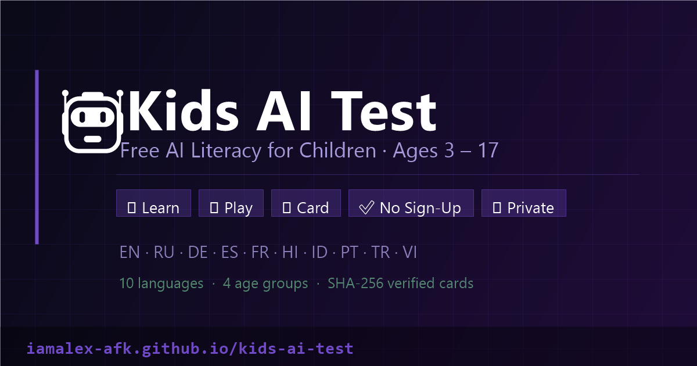

<p align="center">
  
</p>

<h1 align="center">Kids AI Test</h1>
<p align="center"><strong>Teaching kids how AI really works — no marketing, no fear-mongering, just the facts.</strong></p>

<p align="center">
  <a href="https://github.com/IamAlex-afk/kids-ai-test/actions/workflows/pages.yml"></a>
  <a href="LICENSE"></a>
  
  
  
</p>

<p align="center"><strong>🔗 Live: <a href="https://iamalex-afk.github.io/kids-ai-test/">iamalex-afk.github.io/kids-ai-test</a></strong></p>

---

## What it is

A free, installable PWA that teaches children ages 3–17 how AI actually works, through:

- **Age-adapted lessons** — four tiers (3–5, 6–9, 10–13, 14+), each with its own vocabulary, pacing, and depth
- **A sourced quiz** — every answer cites a real primary source (Stanford AI Index, the EU AI Act, peer-reviewed papers), not made-up "facts"
- **Three mini-games** — Snake, a platformer, and a racing game, all reinforcing the same concepts through play
- **A unique result card** — SHA-256-verified, rendered client-side, downloadable as an image
- **Text-to-speech** — lessons are read aloud for children who can't read yet

## Why this exists

Most "AI for kids" content is either a marketing pitch for an AI product, or vague fear-mongering. This is neither: it's a straight, age-appropriate explanation of what AI is, what it isn't, and how to think critically about it — built by a parent, reviewed against primary sources, with zero commercial angle.

## Features

- ✅ **10 languages**, each independently adapted (not machine-translated): en, ru, de, es, fr, hi, id, pt, tr, vi
- ✅ **Zero tracking, zero accounts, zero ads** — everything runs client-side; progress lives only in the browser's own `localStorage`
- ✅ **Installable PWA** — works fully offline after first load
- ✅ **WCAG-conscious** — Lighthouse Accessibility 100
- ✅ **No build step** — plain HTML/CSS/JS, open any file and read it

## Tech stack

Vanilla JavaScript, HTML, CSS. No frameworks, no bundler, no `node_modules`. What you see in the repo is exactly what ships.

## Structure

```
index.html, {lang}.html     10 languages: en, ru, de, es, fr, hi, id, pt, tr, vi
js/core.js                  app logic — age selection, lessons, quiz, results
js/snake.js, platformer.js, racing.js   the three mini-games
js/card.js                  SHA-256 verified result card generator
js/companion.js, glossary.js, leaderboard.js, names.js, parents-faq.js
data/{lang}.js              per-language lesson/quiz content, with sources
css/main.css                all styling, age-based theming via [data-age]
assets/                     sprite art (CC0-licensed, see assets/CREDITS.md)
robots.txt, sitemap.xml, llms.txt, ai.txt   SEO / AI-crawler discoverability
manifest.json, sw.js        installable PWA with offline support
.well-known/security.txt, SECURITY.md
```

## Run locally

No build step — just serve the directory:

```bash
python -m http.server 8080
# open http://localhost:8080
```

## Privacy

No accounts, no ads, no analytics, no cookies. Everything runs client-side.

## License

GPL-3.0 — see [LICENSE](LICENSE). © 2026 Aleksei Sergeevich Bitkin.
